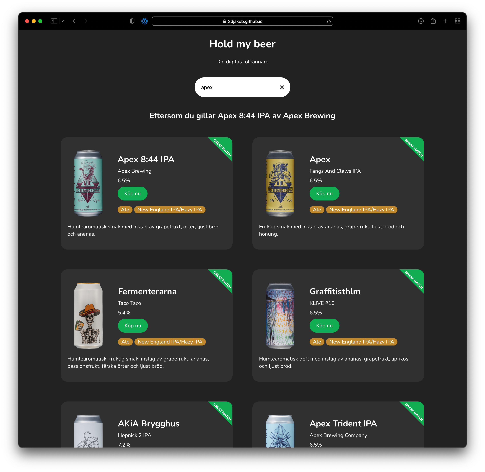

# Hold my beer

## Your digital beer connoisseur!
Hold my beer is a webb app designed to recommend similar beers to the ones you love.

Try it here [https://3djakob.github.io/hold-my-beer/](https://3djakob.github.io/hold-my-beer/)

## Why?

This is a project made for the course TNM108 Machine Learning for social media. The app let's the user browse beers using tf-idf and vector cosine similarity.
