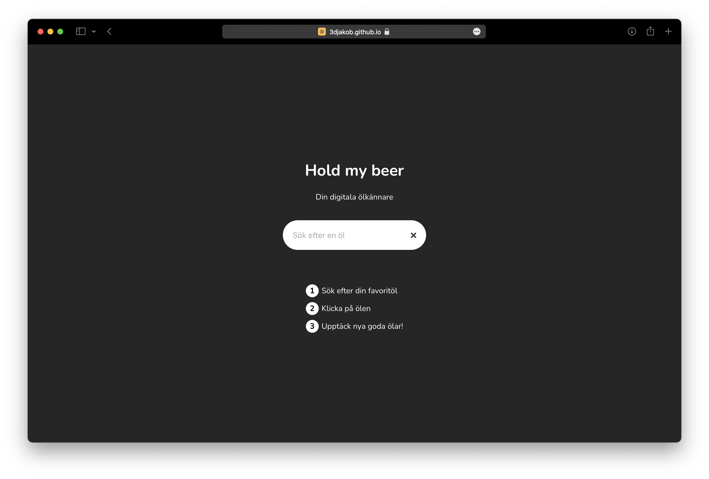
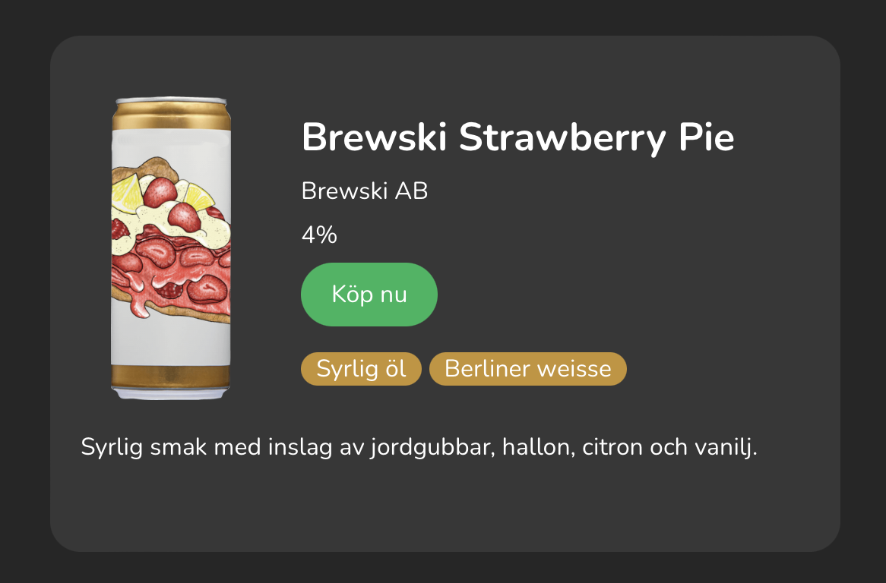

# Hold my beer

## Your digital beer connoisseur!
Hold my beer is an app to demonstrate the usefulness of TF-IDF (Term Frequency-Inverse Document Frequency). The app lets users find new beers similar to the ones they like. 

Try it here [https://3djakob.github.io/hold-my-beer/](https://3djakob.github.io/hold-my-beer/)


## What is TF-IDF and how does it work?

TF-IDF is a method used to classify the similarity between texts. The learner is naive meaning the actual order of words is not taken into consideration when predicting similarity. What this means for this application will be discussed further on. 

### Collaborative vs Content-based filtering

The recommendation of a product or item can be evaluated through different filtering methods. In our case, we choose between collaborative and content-based filtering. 

Content-based filtering uses a product's features and tries to guess the best match for the user. During the recommendation, the similarity calculations use the input as a feature vector and try to find a similar feature vector that describes the input feature.

Collaborative-based filtering does not need features of a product but instead compares users and items to get a feature vector. It collects the user feedback of items either by product rating (explicit feedback) or by a user's behavior/interaction with a product (implicit feedback).

In the beginning, we wanted to use collaborative-based filtering to get a smart match depending on other users' beer preferences, which would have opened the possibility for trending products and collaborative ratings but the data was not retrievable. Instead, we landed in content-based filtering.

### Corpus

Each product contains data about the name of the product, taste, etc. All the useful data is composed into a document for each product. The taste of a product has many insignificant words that do not contribute to a useful description of the product. These are our stop words and are removed before constructing the corpus. This is needed to get a better comparison. For example, the word "beer" in our case will be in every document. We construct the corpus by combining all documents. The implementation of stop words is implemented with the use of the module [stopwords-sv](https://www.npmjs.com/package/stopwords-sv).

By examining the term frequency of our corpus we can see how important a word is in our document. A weight is then assigned to the term according to the occurrence of that word in a document proportional to the term frequency.


### Cosine similarity

Once the corpus is constructed we can start to compare documents. We can either compare existing documents to each other or compare the corpus to a none existing document. To compare the document, we use a method called cosine similarity. Once all word coefficients are calculated in the corpus each document can be plotted in multidimensional space where each word is a dimension. We can then compare documents by calculating the angle between them. This is much easier to visualize in 3D space but it works conceptually the same no matter how many dimensions there are.

### Tiny-IDF

To implement TD-IDF we used a module called [Tiny-IDF](https://www.npmjs.com/package/tiny-tfidf). The module includes a minimal implementation of TD-IDF with cosine similarity. The constructs the corpus completely in ram and is therefore not useful for large-scale datasets but this was not an issue in this use case. We decided to run it on the clientside simply to avoid the need for a server. The downside of this is that the complete dataset needs to be downloaded by the client when visiting. The dataset ended up taking 3.1MB of data which results in the app taking up 4.6MB in total. Also, because we wanted to run it on the client side the corpus needs to be constructed by every user visiting the page as we could not find a way to save the constructed corpus using this module. However, the construction phase only takes a few seconds which is not a problem for this application.

## The dataset

We originally wanted to mine data from untappd.com as it would have allowed us to use a collaborative filtering method. In that case, users would have been able to input their untappd profile name to receive personal recommendations based on what similar users like. However, the untappd API discouraged any form of data mining due to server limitations. We instead decided to use `api-extern.systembolaget.se` as it offered a wide variety of beers with good availability in Sweden.

### Data mining

We managed to find endpoints to `api-extern.systembolaget.se` by looking at the calls made from a browser when visiting [systembolaget.se](https://www.systembolaget.se). We then proceeded to program a simple server that would loop through the pages of results in the beer category and then assemble them into a CSV file. The initial idea was to use a JSON file but we quickly realized that the CSV format was much more suitable as the JSON format iterates the object keys for each object which results in a lot of unnecessary data. 

Once constructed the set contains 4170 unique beers each with 79 different properties. To see all properties check out the [beer type](https://github.com/3DJakob/hold-my-beer/blob/35381e9cdf02090001ed683dc4f5837944ad32b8/src/utils/typings.ts?plain=1#L12).

### Data preprocessing

To load the beers on the client from the CSV file, the library [d3](https://www.npmjs.com/package/d3) was used.

```
const loadBeers = async (): Promise<string[]> => {
 allBeers = []
 await d3.csv(data, function (data: BeerStruct) {
 allBeers.push(data)
 })
 allBeers = removeDuplicates(allBeers)
 return allBeers.map(beer => beerToString(beer))
}
```

Once the data was collected it quickly became apparent that many properties on the beers such as `sugarContentGramPer100ml`, `isSupplierTemporaryNotAvailable`, `seal`, and so on was irrelevant for our search engine. Therefore we selected a slue of properties to construct the documents.

```
const beerToString = (beer: BeerStruct): string => {
 const properties = [
 beer.productNameBold,
 beer.productNameThin,
 beer.categoryLevel1,
 beer.categoryLevel2,
 beer.categoryLevel3,
 beer.categoryLevel4,
 beer.usage,
 beer.taste
 ]
 return properties.join(' ')
}
```

### Data evaluation

The interface lets the user search for a beer name, flavor, aroma, appearance, or any set of words. The app will give the user a result that matches the input words as soon as the search field has a complete word. The app evaluates the user input with the TF-IDF model and if the input matches well with a product, the match will have a green banner that says "great match" to give the user a bit more insight into the result. 


## Results

The result is a web app that can be used [here!](https://3djakob.github.io/hold-my-beer/)

### The UI

A UI was created using [React](https://reactjs.org) from a mockup designed in [Figma](https://www.figma.com). The app consists out of two pages. One landing page and the search page.



All the beers are interactive so if the user finds a beer that they like can click "Köp nu" to open the selected beer on [systembolagets](https://www.systembolaget.se) website. The user can also click anywhere on the card to use that beer as a new search document to find products similar to that beer 



### How well does it work?

The app can recommend new beers based on a beer you like and in our testing, it works well. Based on my personal experience clicking on beers I like yielded a lot of other beers I have tried and can confirm are very similar. In this use case, content-based filtering worked well as the user expects the results to be similar to the beer they input rather than a beer people who liked that beer likes. 
However, if you wanted the app to help the user expand their repertoire of different types of beers rather than finding alternatives to beers they already have tried a collaborative filter would be better.

### Limitations

While the app works well it leaves some to be desired. For instance, it would be nice to be able to base a search on multiple beers to get a better-refined result.

The search bar is also quite unintuitive as it uses the same TF-IDF to find matches which results in the user needing to spell everything completely correct. Normally a library like [fusejs](https://fusejs.io) solves this but in this particular case, it would be hard to implement without replacing the TF-IDF entirely for the search bar.

There are also some limitations with the search method used (TF-IDF), for instance, if one brewery creates a lot of completely different beers they will still be classified as more similar than others as their name and brewery name coincides. One option is to exclude the brewery name from the search engine entirely however we decided against it as beers from the same brewery are still more likely to be similar and if the user likes a beer from that brewery they are more likely to like another of their beers. The best solution, in this case, would probably be to only let the brewery name weigh into the result if the type of beer is the same. However, making specific rules like this adds complexity to the code and makes it less adaptable to new or other data.

Because of the way TF-IDF works we could potentially run into scaling issues if the dataset would substantially be expanded as every single item needs to be compared to all other items when searching. This however is not an issue with the current data as 4170 documents is still a very small number in computer terms.